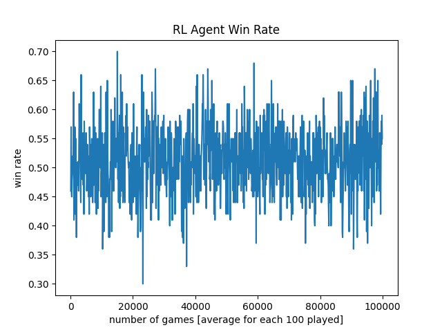

# Computational Intelligence

## Final Project - Quarto

The solution is based on all previously acquiared knowledge during Computational Intelligence course.

### Problem description

Quarto is a two-player strategy board game where the objective is to place pieces with certain attributes, such as height or color, in a way that forms a line of four pieces that match in one attribute. Each player takes turns choosing a piece and placing it on the board, with the goal of either creating a line of four matching pieces or blocking the opponent from doing so. The game requires careful consideration of both the placement of pieces and the attributes of the pieces available to choose from. The player who succeeds in placing four pieces in a line first wins the game (ChatGPT definition).
The goal of this project is creating an sgent who will be able to play the game of Quarto against a random agent and other combinations of agents.

### Reinforcement Learning Agent

At first I turned my interest at the possibility of using a Reinforcement Learning approach. I based my solution on an example presented during the laboratory and also on the experience I used solving the problem of NIM RL Agent. I started by introducing two separate `G` dictionaries, one `G_board` for the list of the moves and `G_pieces` for all of the used pieces. I also kept two separate history boards, `state_history_board` and `state_history_pieces`. The `G` dictionaries were initialised with random values.
The reward was given under 3 conditions:

1. `reward = -10` for the final losing move;
2. `reward = 10` for the final winning move;
3. `reward = 0` for every other move.

#### Results

Unfortunately I reached the same point as with NIM RL Agent. My agent was learning but really slowly and the win rate was oscilationg around 50%, with slight improvements. That is why I quickly decided to change my strategy and go back to what worked for me best on previous exercises - Evolutionary Algorithm.

In the case presented on the plot RL Agent won 51.335 % of the times.

### Evolutionary Algorithm Agent

For the Evolutionary Algorithm solution I took the same approach as for the NIM laboratory. At first I created a number of hard-coded strategies:

1. `lowest_piece` - chooses an available piece with the lowest number assigned;
2. `highest_piece` - chooses an available piece with the highest number assigned;
3. `random_piece` - chooses a random available piece;
4. `unique_piece` - strategy which uses two functions - `get_pieces` (returns stats on currently placed pieces as a table - e.g. how many pieces placed are tall, how many dark etc. and counts the separate chaacteristics and puts them in a table) and `compare_characteristics` (checks the characteristic of left, available pieces and compares them to theoretical piece that either stands out most or is the most similar), the strategy itself chooses the piece that is the most unique compared to the ones that are already on the board.
5. `similar_piece` - approach equivalent to the `unique_piece`, but the outcome is opposite, it chooses the piece that has the most characteristics similar to the pieces that are already on the board;
6. `left_upper` - chooses the most lower left place on the board available;
7. `right_lower` - chooses the most lower right place on the board available;
8. `right_upper` - chooses the most upper right place on the board available;
9. `random_place` - chooses random available place on the board;
10. `far_place` - chooses place the furthest from other pieces;
11. `close_place` - chooses place the closest to the other pieces;

As you can see above the genome consists both of genes regarding the choice of the placement of a piece and a choice of piece itself. For that reason for separate moves (either choice of piece or place) the genome is split into two - one part for one action, second part for the other action.

#### Genome

Genome is a set of values between 0.0 and 1.0. There are 11 of these values, qual to the number of partial strategies. When choosing a strategy to use the partial genomes are first multiplied by 100. Then each value is assigned a number from 1 to the length of the genome and they're enclosed in a new list from which we choose a value randomly.
E.g. genome has three genes: [0.1, 0.3, 0.6]:

1. We multiply the partial values by 10 (originaly it's 100), getting: [1, 3, 6];
2. Then we assign to each position in the list an integer value: 1, 2 or 3;
3. We create a new list where integer values are repeated a number of times assigned at point 2., so we get: [1, 2, 2, 2, 3, 3, 3, 3, 3, 3].
4. We choose a random value from that list. It's easy to see that 3 appears most of the times, so the probability to pick the strategy 3 is the biggest, like in the original list (0.6).

#### Fitness

The fitness value assigned to each genome is simply a percentage of games won against an opponent. Then in each modification of a population the genomes are sorted by the value of fitness.

#### Crossovers, Mutations and Modifications

I implemented two types of crossovers:

1. `cross_over` - a basic version of crossover where I take one part of genome and combine it with the remaining part of the other genome;
2. `average_cross_over` - a crossover where I take both genomes and for each gene I create an average value between equivalent genes belonging to two different genomes.

Function `mutation` allows to randomly modify the value of one gene. Regarding the modifications in the population `modify_population` replaces a number of worst genomes in the population and replaces them with new randomly created genomes. It's an additional mean of introducing more exploration than exploitation.

#### Evaluate function

Evaluate function allows us to check our agent not only playing as first but also as the second player as number of games where my agent starts and where the opponent starts are divided 50/50.

#### Parameters

There was a number of parameters to be set before running the Evolutionary Agent:

1. `POPULATION_SIZE = 20`;
2. `NUM_GENERATIONS = 1000`;
3. `OFFSPRING_SIZE = 10`;
4. `NUM_MATCHES = 100`;
5. `TOP_POPULATION_LENGTH = 5` - the length of the population from the best genomes that is used to evaluate if a top genomes were repeated a number of times (used for `modify_population`);
6. `TOP_POPULATION_REPETITIONS = 5` - the counter of repetitions of top genomes after which we run `modify_population`;
7. `NUM_GENOMES_TO_REMOVE = 10` - number of genomes replaced in `modify_population`;
8. `EXPLORATION_RATE = 0.2` - number telling us how often we run `modify_population` regardless of top population counter;
9. `MUTATION_RATE = 0.2` - how often mutation is called;
10. `CHOOSE_CROSSOVER_RATE = 0.4` - how often `cross_over` is called with respect to `average_cross_over`.

#### Results

The experiment was ran on parameters presented above. The statistics for this experiments were following:

1. `total_offspring_counter = 12210` - technically the number of generations is equal to 1000 and the offspring size equal to 10, but because of creation of duplicates the offspring has to be regenerated, that is why the number is higher than 10000;
2. `average_co_counter = 4966` - number of times `average_cross_over` was called;
3. `normal_co_counter = 7244` - number of times `cross_over` was called;
4. `mutation_counter = 2405` - number of times `mutation` was called;
5. `explore_counter = 193` - number of times `modify_population` was called;
6. `top_population_rep_counter = 157` - number of times top population repeated what resulted in calling the `modify_population`.

Top 3 genomes in the initial population:

1. (genome=(0.28, 0.13, 0.86, 0.71, 0.83, 0.94, 0.78, 0.65, 0.34, 0.22, 0.15, 0.8), fitness=0.64);
2. (genome=(0.21, 0.01, 0.49, 0.42, 0.87, 0.26, 0.78, 0.04, 0.07, 0.09, 0.02, 0.86), fitness=0.62);
3. (genome=(0.81, 0.72, 0.57, 0.75, 0.26, 0.93, 0.13, 0.82, 0.98, 0.41, 0.46, 0.22), fitness=0.61).

The maximal initial fitness was equal to 0.64.
Top 3 genomes after running the experiment:

1. (genome=(0.4153, 0.32, 0.86, 0.71, 0.83, 0.94, 0.78, 0.04, 0.07, 0.09, 0.02, 0.22), fitness=0.77);
2. (genome=(0.28, 0.13, 0.7762, 0.6396, 0.8444, 0.94, 0.78, 0.04, 0.07, 0.09, 0.02, 0.22), fitness=0.77);
3. (genome=(0.23, 0.6638, 0.4875, 0.4025, 0.8381, 0.5956, 0.7125, 0.3888, 0.1837, 0.14, 0.135, 0.2274), fitness=0.76).

The fitness reached 0.77 after 1000 generations (running for 1 hour). The improvement is visible compared not only to Random Agent but also to RL Agent.

### Conlusions

The final results are satisfactory but the performance is limited. In the final registered run the fitness (win rate) reached 0.77. In previous runs the highest fitness reached was equal to 0.80 after a lot more generations, which means that the improvement after reaching ~ 0.75 is marginal. The solution could be improved by introducing more partial strategies, maybe some that could be considered "better". Another way to improve the algorithm could be tweaking the parameters. Nevertheless there is an improvement so the algorithm is working in a correct manner.

